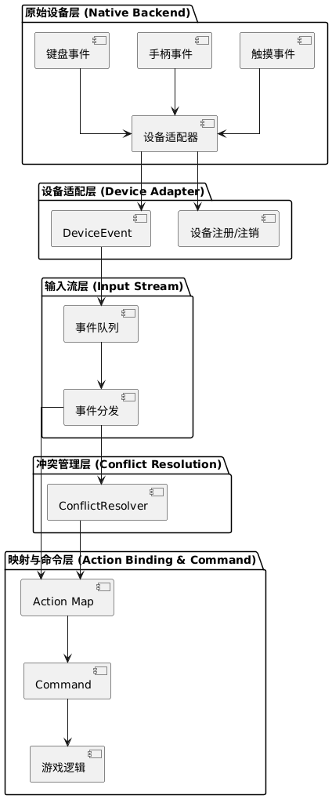

## 问题
### 介绍
某游戏需要支持PC、手机、主机三端操作，且允许玩家自定义按键映射，请设计一个输入控制模块支持以下能力。
1.支持运行时动态切换设备类型（如从手柄切换为触屏）
2.允许玩家为同一操作绑定多个输入方式（如"攻击"可同时绑定键盘空格键和手柄A键）
3.需处理多端输入事件冲突（如触屏滑动时禁止手柄方向键触发）
4.尽量控制新增设备时，对既有模块的修改。

## 设计方案

### 1. 整体架构设计

### 2. 核心类设计

#### 2.1 原始设备层（Native Backend）
- 负责采集各平台原生输入事件（键盘、手柄、触摸等）
- 实现设备热插拔检测
- 自动发现和移除设备，无需重启游戏

#### 2.2 设备适配层（Device Adapter）
- 采用适配器模式，将原生事件封装为统一 DeviceEvent 对象
- 提供标准接口：
  - registerDevice()
  - unregisterDevice()
  - pollEvents()
- 隐藏平台差异，提供统一的事件格式

#### 2.3 输入流层（Input Stream）
- 维护单一事件队列，保证事件的时间顺序
- 支持多线程安全操作
- 高性能实现，避免垃圾分配
- 统一事件分发机制

#### 2.4 映射与命令层（Action Binding & Command）
- Action Map：从配置文件加载用户自定义绑定
- Command 模式：将动作封装为可执行对象
- 支持多输入触发同一命令
- 统一命令执行接口

#### 2.5 冲突管理层（Conflict Resolution）
- 基于策略模式实现冲突处理
- 支持多种冲突解决策略：
  - 触摸优先
  - 最后输入优先
  - 设备优先级
- 在命令执行前进行冲突检测和解决

### 3. 关键设计说明

1. **可扩展性**
   - 新增设备只需实现对应的 Device Adapter
   - 不影响现有代码结构
   - 支持运行时动态切换设备

2. **性能优化**
   - 事件队列采用无锁设计
   - 避免内存分配
   - 高效的事件分发机制

3. **用户体验**
   - 支持自定义按键映射
   - 智能冲突处理
   - 无缝设备切换

## 项目运行说明

在项目最上层运行 `run.sh`。